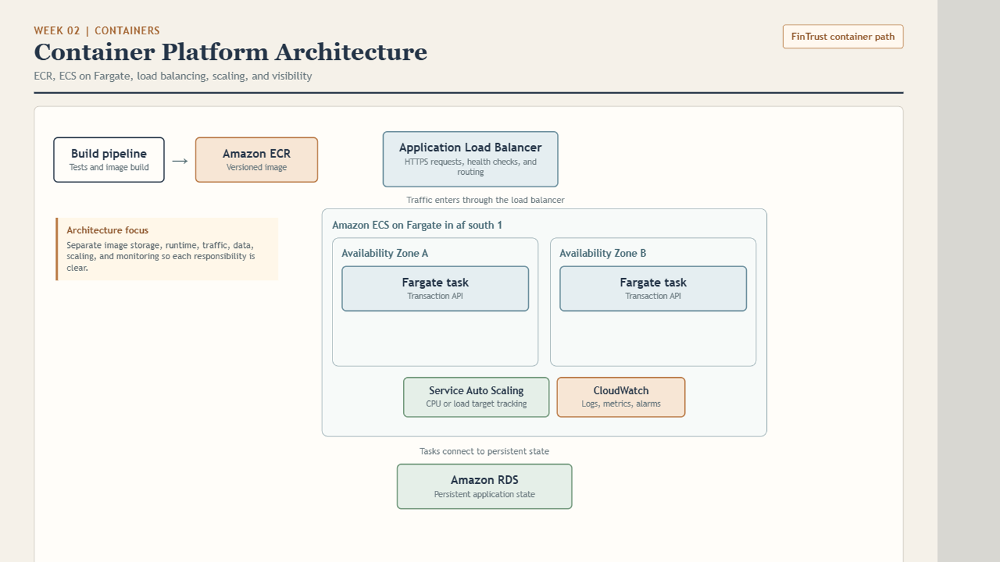
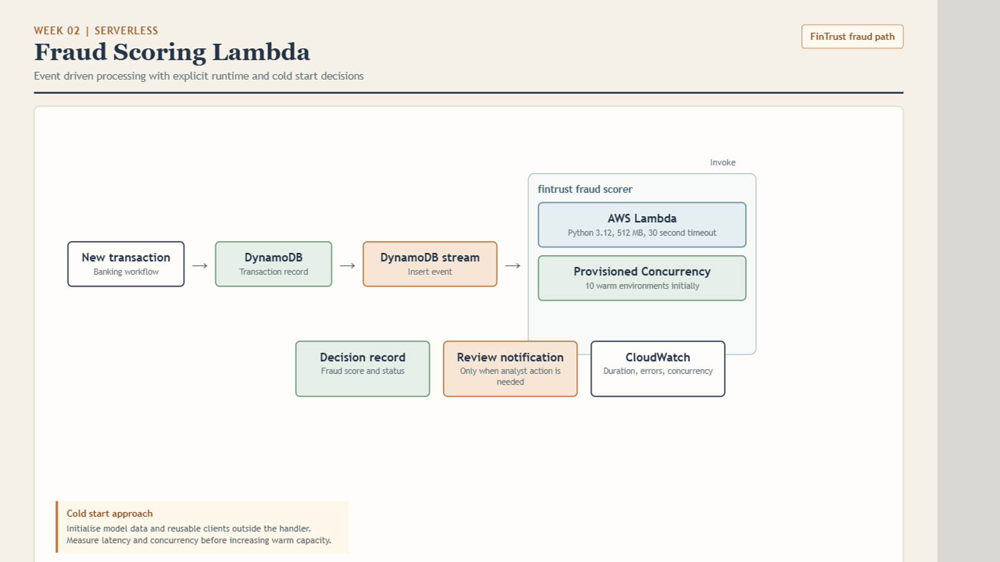
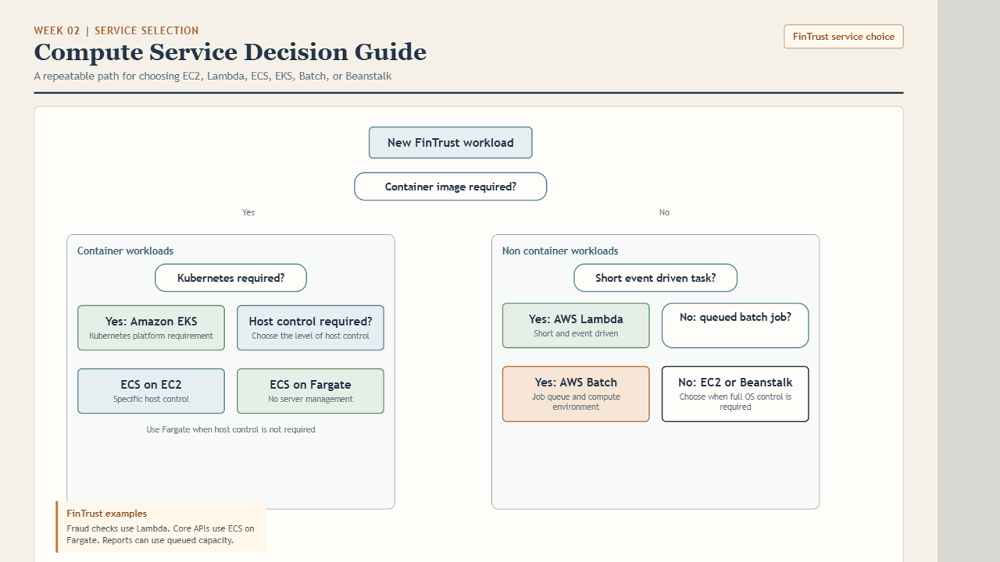
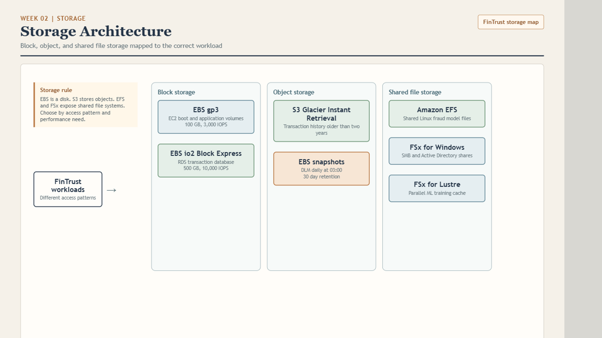
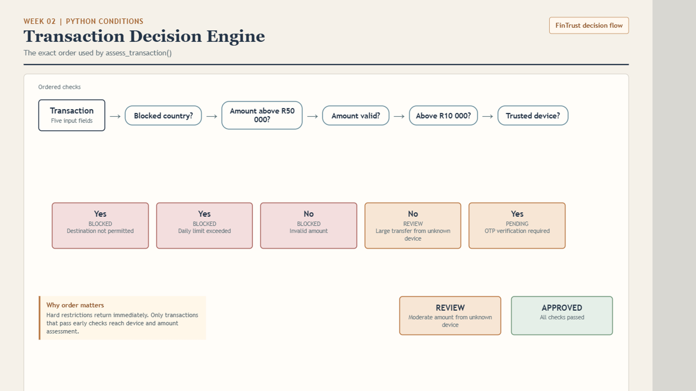

# Week 02: Architecture Diagrams

These diagrams present the Week 02 architecture and decision topics in a consistent format. Each explanation describes what the diagram communicates and why the design matters.

## 1. Container Platform Architecture

The container platform starts with a build pipeline that creates a versioned image in Amazon ECR. Amazon ECS on Fargate runs the transaction API in two Availability Zones, reducing dependence on one location. An Application Load Balancer receives HTTPS requests, performs health checks, and routes traffic to healthy tasks. Service Auto Scaling adjusts task capacity based on demand, Amazon RDS stores persistent application state, and CloudWatch provides logs, metrics, and alarms.

This design separates image management, runtime execution, traffic distribution, data storage, scaling, and monitoring.

## 2. Fraud Scoring Lambda

A new transaction is stored in DynamoDB. The DynamoDB Stream records the insert event and invokes the fraud scoring Lambda function. The function calculates the fraud result and sends the decision record to the next workflow step. A review notification is created only when analyst action is required. CloudWatch monitors duration, errors, and concurrency.

Provisioned Concurrency is shown as an explicit performance decision. The number of warm environments should be measured against actual latency and concurrency before it is increased.

## 3. Compute Service Decision Guide

The decision guide begins with the workload requirement. If a container image is needed, the next question is whether Kubernetes is required. Amazon EKS is selected when a Kubernetes platform is a requirement. If Kubernetes is not required, the choice depends on whether specific host control is needed, leading to ECS on EC2 or ECS on Fargate.

For workloads that do not need a container image, the guide checks whether the task is short and event driven, whether it is a queued batch job, and whether full operating system control is required. These questions lead to Lambda, AWS Batch, EC2, or Beanstalk.

## 4. Storage Architecture

The storage diagram groups services by the way the workload accesses data. EBS provides block storage for EC2 volumes and high performance database storage. S3 Glacier Instant Retrieval is used for older transaction history that still needs rapid retrieval. EBS snapshots provide a scheduled backup path. Amazon EFS provides shared Linux file storage, while FSx for Windows supports SMB and Active Directory shares. FSx for Lustre provides a shared performance focused cache for parallel machine learning workloads.

The main design decision is to choose storage based on access pattern, performance, sharing, retention, and operating system requirements.

## 5. Transaction Decision Engine

The transaction flow shows the order used by the decision function. A blocked country is rejected first, followed by the daily amount limit and amount validation. Transactions that pass those checks are assessed against the higher amount threshold and trusted device status. The outcomes are blocked, pending, review, or approved.

The ordering matters because hard restrictions should return immediately. Only transactions that pass the early checks should continue to device and amount assessment. This makes the rule sequence easier to test, explain, and audit.

## Week 02 requirements

The Praesignis Portfolio Check-In #2 requires joins_practice.sql, aggregates_report.sql, transaction_flowchart.py, and conditionals.py. README and architecture notes support the portfolio and earn bonus marks. These diagrams explain the compute, storage, and transaction topics; they do not replace the required SQL and Python files.

The transaction diagram highlights the required ordering of the blocked-country check before any amount check.

Source: [Praesignis Week 02 Portfolio Check-In #2](https://edusignis.praesignis.com/mod/resource/view.php?id=9934).
